# Payment Fraud Monitoring Platform

Enterprise-grade payment fraud detection, monitoring, investigation, and cloud event processing platform built using FastAPI, PostgreSQL, AWS, and Streamlit.

---

## Project Overview

The Payment Fraud Monitoring Platform simulates how modern financial institutions monitor transactions, detect fraud, investigate suspicious activity, process payment gateway events, and generate operational dashboards.

The platform demonstrates:

- REST API development
- Payment processing workflows
- Fraud detection rules
- Case management
- Audit logging
- PostgreSQL database design
- AWS cloud integration
- Dashboard reporting
- Manual and automated testing
- Business Analyst documentation
- QA artifacts

---

## Business Problem

Financial institutions process thousands of transactions every second.

Fraud analysts need systems that can:

- Detect suspicious transactions
- Generate fraud alerts
- Investigate cases
- Process chargebacks
- Monitor payment events
- Maintain audit trails
- Produce operational dashboards

This project simulates an end-to-end fraud monitoring platform used by banks, payment processors, and fintech companies.

---

## Architecture

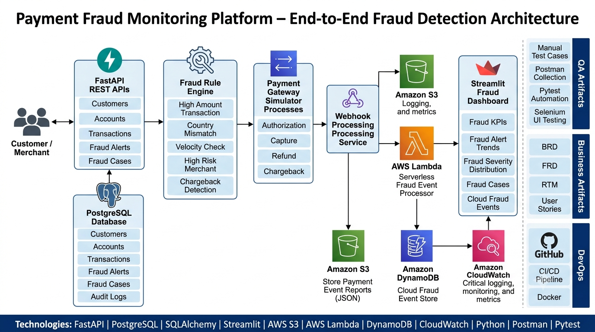

---

## Technology Stack

### Backend

- FastAPI
- Python
- SQLAlchemy
- Pydantic

### Database

- PostgreSQL

### Cloud

- AWS S3
- AWS Lambda
- AWS DynamoDB
- AWS CloudWatch

### Dashboard

- Streamlit
- Plotly

### Testing

- Postman
- Pytest
- Manual Test Cases

### DevOps

- Git
- GitHub
- GitHub Actions

---

## Quick Start

Clone repository

git clone <repo-url>

Create virtual environment

python -m venv venv

Activate environment

venv\Scripts\activate

Install dependencies

pip install -r requirements.txt

Run FastAPI

uvicorn app.main:app --reload

Run Dashboard

streamlit run dashboard/app.py

Run Tests

pytest

---


## Core Features

### Customer Management

- Create customer
- View customer list
- Customer validation

### Account Management

- Create account
- View accounts
- Balance tracking

### Transaction Processing

- Create transaction
- Transaction history
- Fraud evaluation

### Fraud Detection

Rules implemented:

- High Amount Transaction
- Country Mismatch
- Velocity Fraud
- High Risk Merchant
- Chargeback Detection

### Fraud Alerts

- Alert creation
- Severity tracking
- Alert monitoring

### Fraud Case Management

- Open case
- Assign investigator
- Update case status
- Close case

### Login Event Monitoring

- OTP failures
- Impossible travel detection
- Suspicious login monitoring

### Payment Gateway Simulator

Simulated payment lifecycle:

- Authorization
- Capture
- Refund
- Chargeback

### Webhook Processing

Processes external payment events and creates fraud records.

### AWS Event Processing

- Upload payment events to S3
- Trigger Lambda processing
- Store fraud decisions in DynamoDB
- Monitor execution through CloudWatch

---

## Application Screenshots

### FastAPI APIs

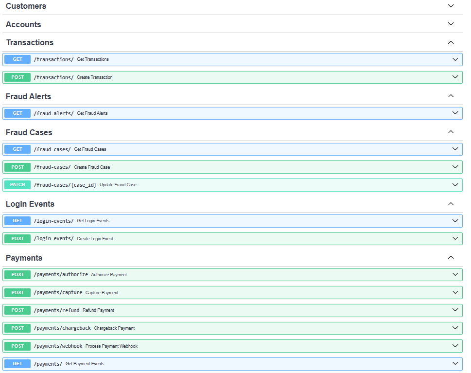

### Create Account API

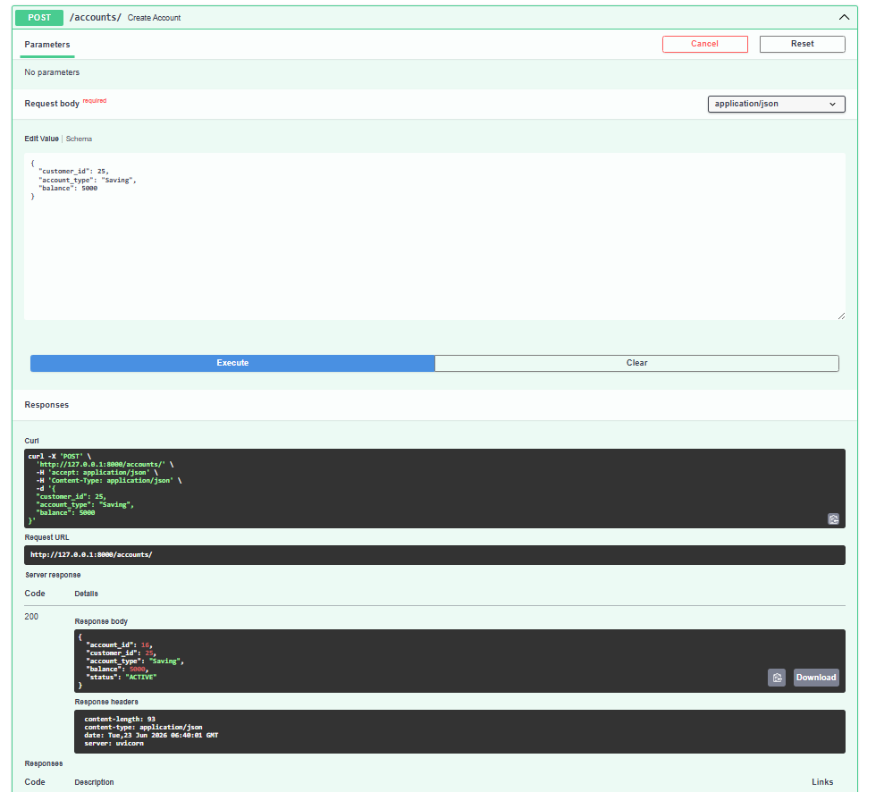

### Get Accounts API

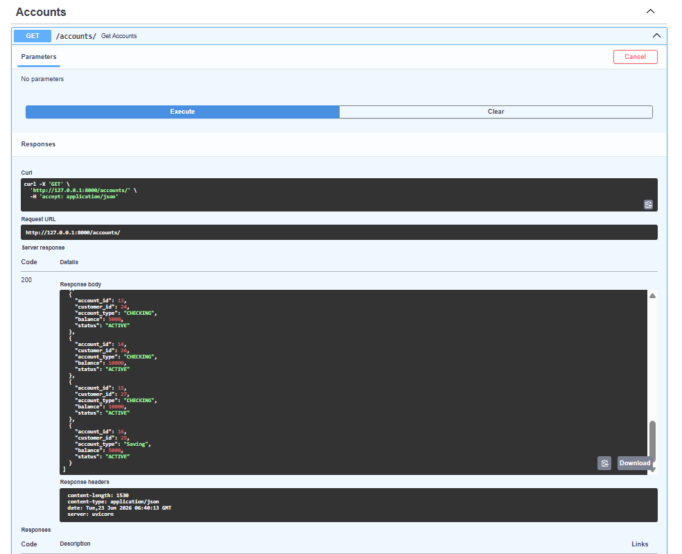

### Fraud Dashboard

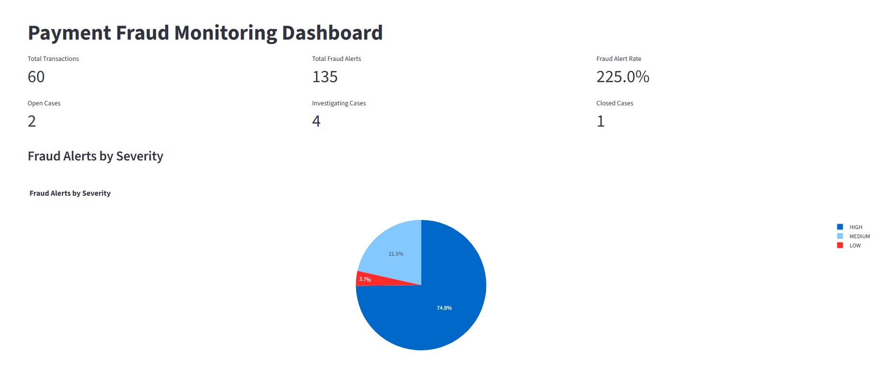

### Cloud Fraud Dashboard

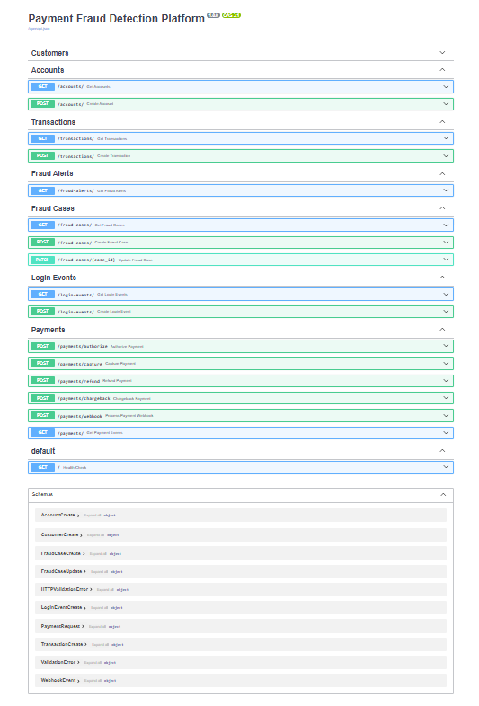

### PostgreSQL Data

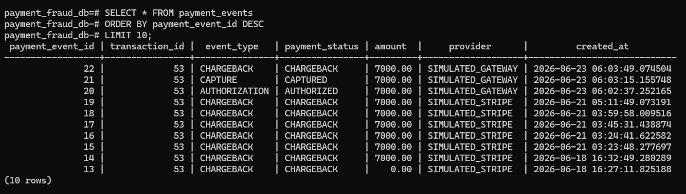

### Fraud Alerts

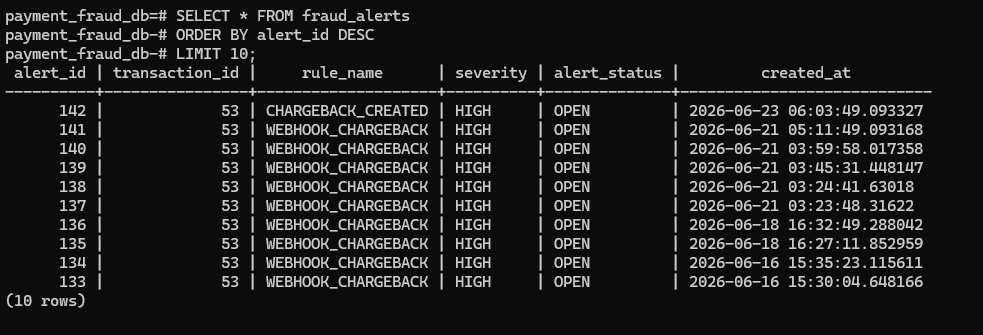

### Fraud Cases

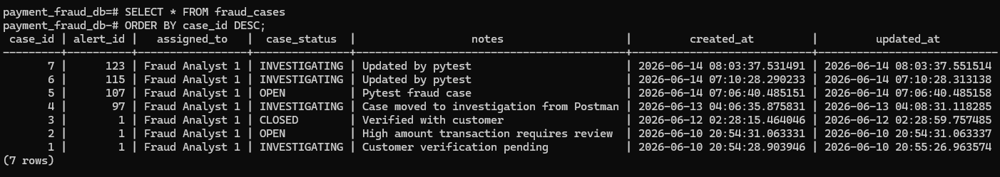

### AWS S3

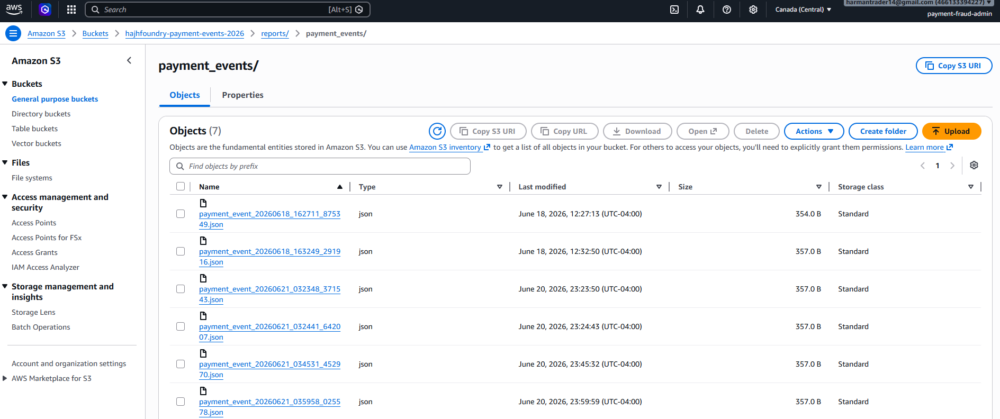

### AWS DynamoDB

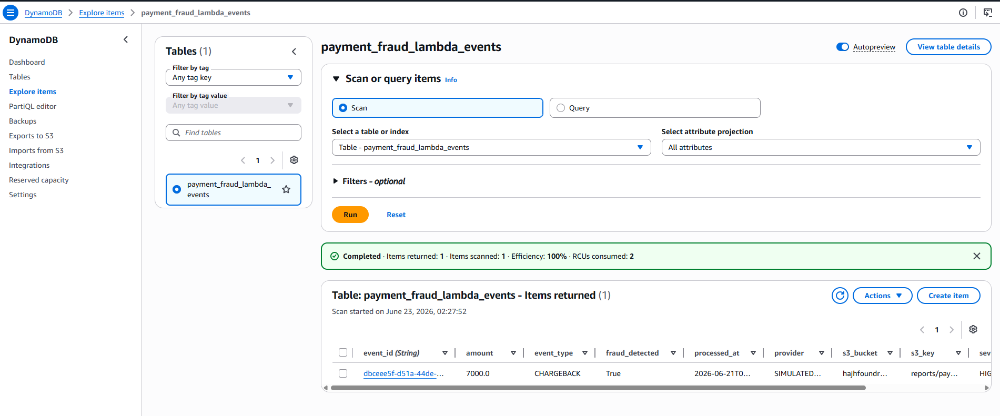

### CloudWatch Logs

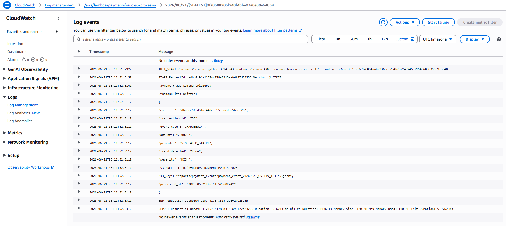

---

## Database Tables

### customers

Stores customer information.

### accounts

Stores customer accounts.

### transactions

Stores payment transactions.

### fraud_alerts

Stores generated fraud alerts.

### fraud_cases

Stores fraud investigation cases.

### login_events

Stores authentication events.

### payment_events

Stores payment gateway events.

### audit_logs

Stores compliance and audit history.

---

## Testing

### Manual Testing

Located in:

```

docs/manual-test-cases/

```

Includes:

- Customer API Tests
- Account API Tests
- Transaction Tests
- Fraud Rule Tests
- Dashboard Tests
- AWS Integration Tests
- End-to-End Tests

### Postman Testing

Includes:

- CRUD API validation
- Negative testing
- Fraud scenarios
- Payment workflows

### Pytest Automation

Automated API validation suite.

---

## Repository Structure

payment-fraud-monitoring-platform/

├── app/
│   ├── api/
│   ├── database/
│   ├── services/
│   └── main.py
│
├── dashboard/
│   └── app.py
│
├── tests/
│   └── pytest automation
│
├── docs/
│   ├── screenshots/
│   ├── manual-test-cases/
│   ├── qa/
│   └── interview/
│
├── requirements.txt
└── README.md

---

## Documentation

### Architecture

```

docs/architecture.md

```

### Manual Test Cases

```

docs/manual-test-cases/

```

### QA Package

```

docs/qa/

```

### Interview Package

```

docs/interview/

```
---
## CI/CD

GitHub Actions pipeline automatically:

- Installs dependencies
- Creates database tables
- Starts FastAPI server
- Executes Pytest suite
- Validates API functionality

Current Status:

✅ All automated tests passing


---

## End-To-End Flow

Customer
→ FastAPI APIs
→ PostgreSQL
→ Fraud Rule Engine
→ Payment Gateway Simulator
→ Webhook Processing
→ AWS S3
→ AWS Lambda
→ DynamoDB
→ CloudWatch
→ Streamlit Dashboard

---

## Skills Demonstrated

### Software Engineering

- Python
- FastAPI
- REST APIs
- SQLAlchemy

### Database

- PostgreSQL
- SQL Queries
- Data Modeling

### Cloud

- AWS S3
- AWS Lambda
- DynamoDB
- CloudWatch

### QA

- Manual Testing
- Postman
- Pytest
- RTM

### Business Analysis

- User Stories
- RTM
- Requirements Documentation

### Product Ownership

- Backlog Planning
- Feature Prioritization
- Fraud Investigation Workflows

---

## Future Enhancements

- Docker Deployment
- AWS API Gateway
- Kaggle Transaction Dataset Import
- Selenium UI Automation
- Real-Time Fraud Analytics
- Machine Learning Fraud Scoring

---

## Project Statistics

- 8 PostgreSQL Tables
- 20+ REST API Endpoints
- AWS S3 Integration
- AWS Lambda Processing
- DynamoDB Event Storage
- CloudWatch Monitoring
- Streamlit Dashboard
- Pytest Automation Suite
- GitHub Actions CI/CD

---


## Author

Harpreet Singh

Independent Technology Consultant

Portfolio project demonstrating enterprise fraud detection, payment processing, cloud integrations, QA automation, and business analysis workflows.